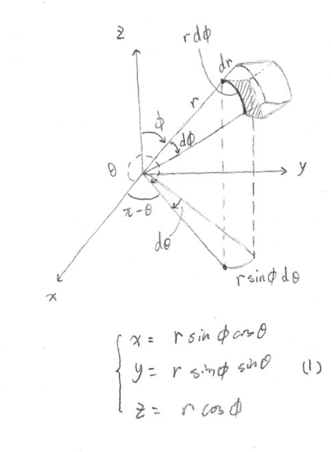
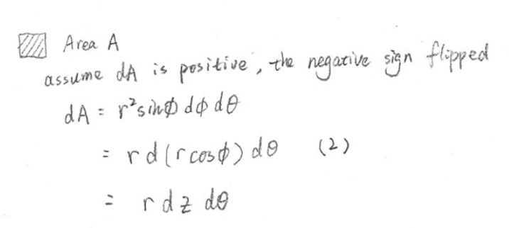
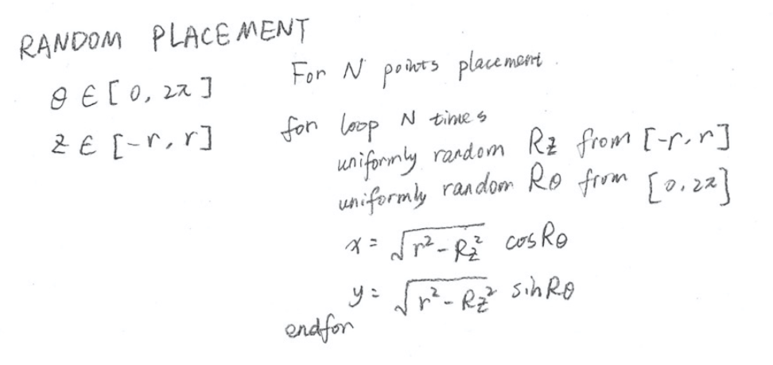
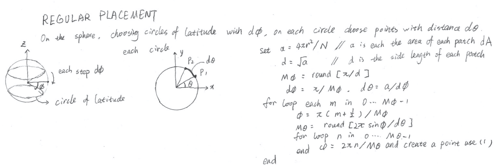
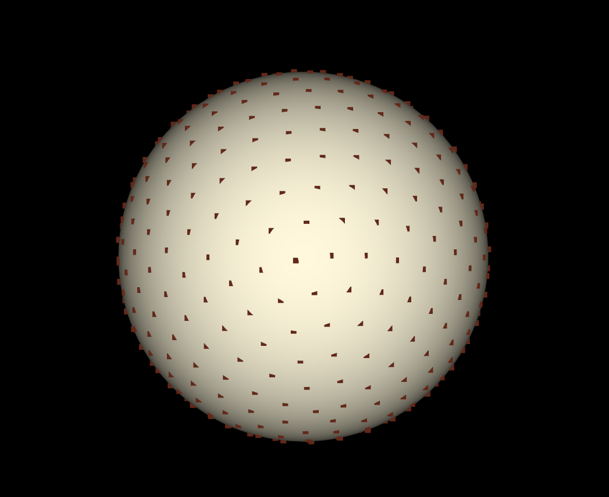

## Generating Points On A Sphere

In order to render multiple pictures of a 3D model from multiple camera point of views, I need to place a camera to various position on a unit sphere, and the model at the origin of the sphere. To cover all possible viewing angle of the model with minimum number of pictures, I want the positions on a sphere to be uniformly distributed, and also could be evenly separated on a sphere.

The algorithm is shown in the following pictures.  

This picture shows the description of a point on a sphere with radius **r**.    

We want points evenly or distribute uniformly on a sphere surface, thus we will consider the patch on a sphere surface as **dA** which represents the derivative of sphere surface.

#### Random Placement

The algorithm to calculate each points on sphere randomly distributed on sphere.  

  

#### Regular Placement

The algorithm to calculate each points on sphere separate evenly with some distance between nearby points in two orthogonal directions.

  

#### Result

**Regular Placement Points**  

  

#### Reference
_How to generate equidistributed points on the surface of a sphere_, Markus Deserno, 2004  
[Link](https://www.cmu.edu/biolphys/deserno/pdf/sphere_equi.pdf)
